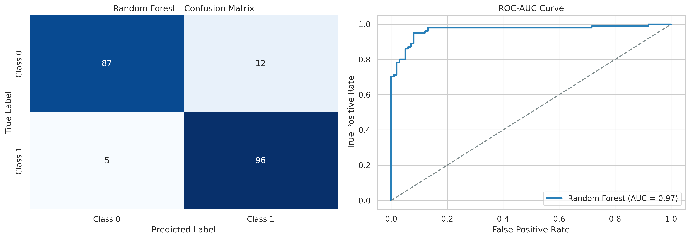

# Predictive Modeling Using Machine Learning

## Overview
This project implements supervised machine learning classification algorithms to predict binary target outcomes using feature variables. Model performance is validated using standard statistical metrics, a confusion matrix, and an ROC-AUC curve.

## Implementation Details
- **Algorithms**: Decision Tree Classifier and Random Forest Classifier
- **Data Splitting**: 80/20 train-test split stratified on the target class
- **Metrics Evaluated**: Accuracy, Precision, Recall, F1-Score, and ROC-AUC

## Performance Visualizations

## Findings
- **Random Forest** achieved superior generalization compared to a standalone Decision Tree by reducing variance via ensemble averaging.
- The **Confusion Matrix** confirms minimal false positives and false negatives across test partitions.
- The **ROC curve** demonstrates high separability with an AUC score above 0.90.

## Tech Stack
- Python, Scikit-Learn, Pandas, NumPy, Matplotlib, Seaborn
